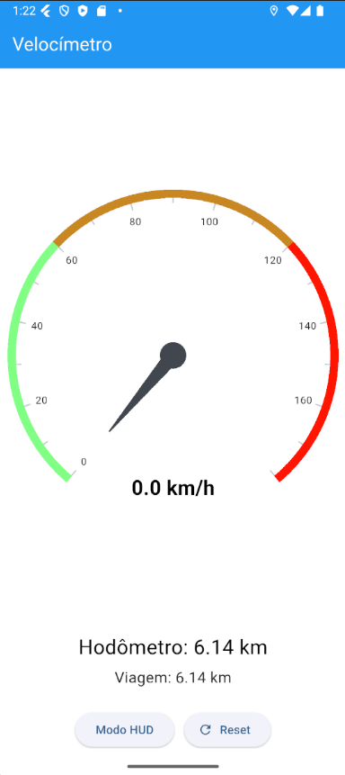
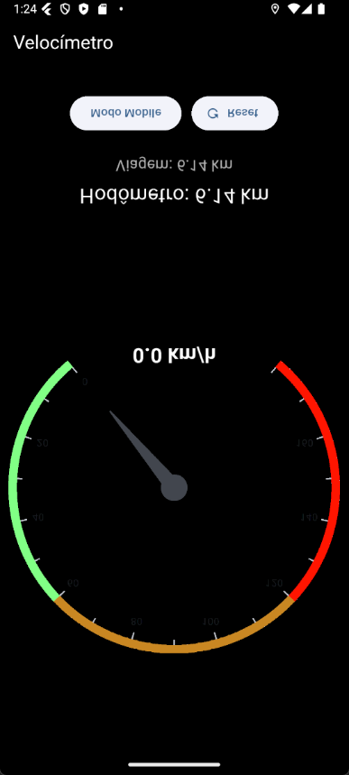
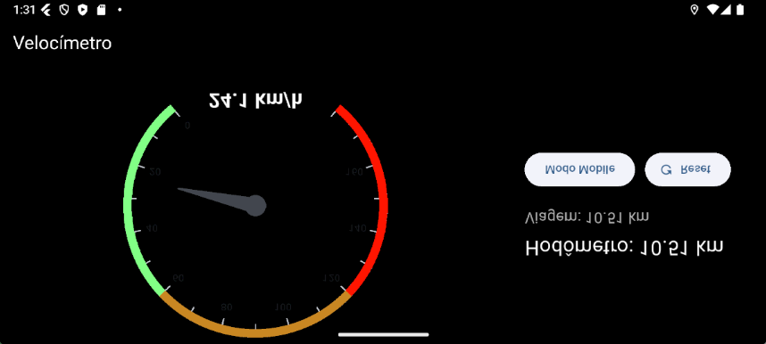

# Velocímetro Flutter (MOBILE II)

Um aplicativo de **velocímetro digital** desenvolvido em Flutter, com suporte a **modo HUD (Head-Up Display)**, **hodômetro total** e **hodômetro de viagem (trip)**. Ideal para uso no carro apoiado no painel.

---

## 🔍 Funcionalidades

- **Leitura de velocidade em tempo real** (km/h)
- **Hodômetro total** (distância total percorrida)
- **Hodômetro de viagem** (resetável)
- **Modo HUD (espelhado verticalmente)** para projeção no para-brisa
- **Botão de Reset** para zerar a viagem
- **Layout adaptativo** (retrato e paisagem)

---

## Capturas de Tela

### Modo Mobile:




### Modo Mobile:




---

## Uso Sugerido

- **Modo HUD**: coloque o smartphone deitado no painel do carro e ative o modo HUD. A tela será espelhada verticalmente para refletir corretamente no para-brisa.
- **Hodômetro de Viagem**: reinicie antes de começar uma viagem para acompanhar a quilometragem da rota.

---


## 🚀 Como Executar

1. Clone o repositório:

   ```bash
   git clone https://github.com/LuisPereira05/HUDSpeedometerLCMR.git
   cd HUDSpeedometerLCMR
   flutter devices
   flutter run -d <device id>
   ```
## Contribuindo

Contribuições são muito bem-vindas! Para colaborar com o projeto, siga as etapas abaixo:

1. **Fork** este repositório.
2. Crie uma nova **branch** com a sua funcionalidade ou correção:

   ```bash
   git checkout -b minha-contribuicao
   ```
3. Faça suas alterações e commit:
   ```
   git commit -m "Adiciona nova funcionalidade"
   ```
4. Envie sua branch para o seu fork:
   ```
   git push origin minha-contribuicao
   ```

5. Abra um Pull Request para o repositório original e descreva suas mudanças.

Antes de enviar seu PR, verifique se o código está limpo, bem documentado e, se possível, com testes.

